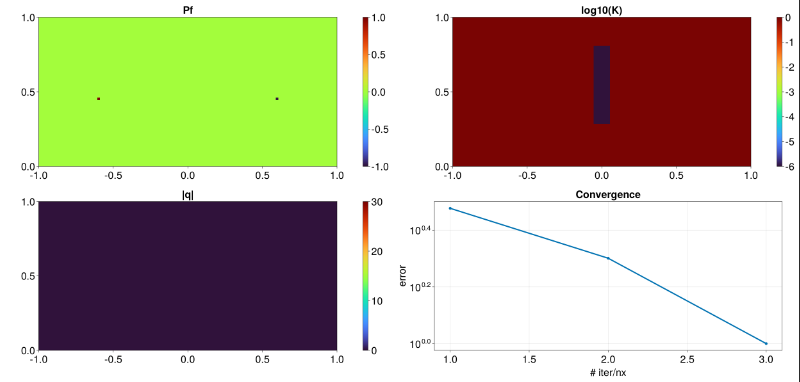
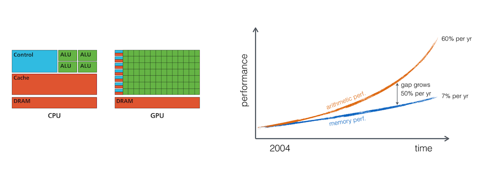
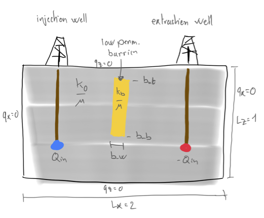
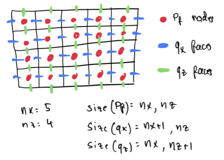
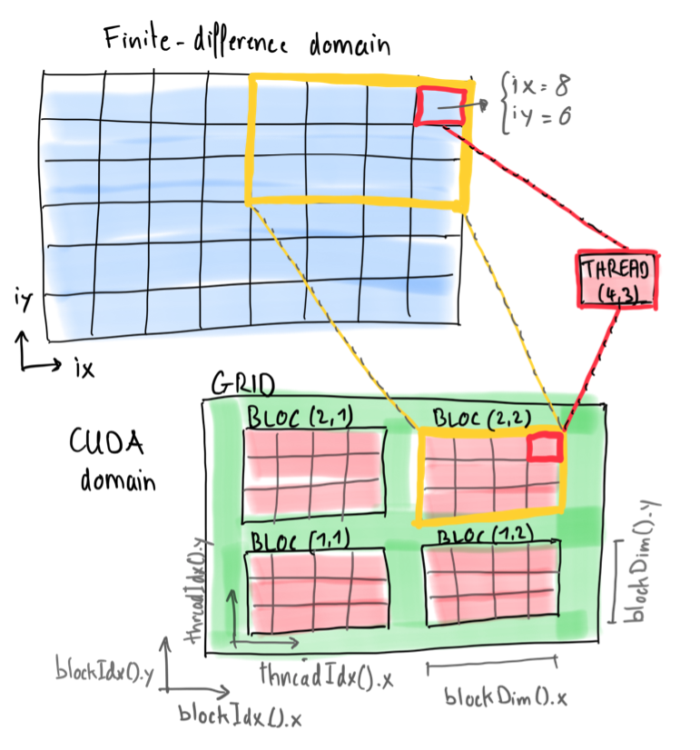

# Julia-HPC-Scales
Julia for HPC workshop @ [**SCALES conference 2023**](https://model.uni-mainz.de/scales-conference-2023/)

| The computational resources for this workshop are provided by the      |                |
| :------------: | :------------: |
| [**Paderborn Center for Parallel Computing (PC2)**](https://pc2.uni-paderborn.de/) | [](https://pc2.uni-paderborn.de/) |
| **PC2** is a member of the [**NHR Alliance**](https://www.nhr-verein.de/) | [](https://www.nhr-verein.de/) |

> :warning: Make sure to `git pull` this repo right before starting the workshop on Monday morning in order to ensure you have access to the latest updates

## Program

### Morning session (9h - 12h30)
- [Noctua 2: VSCode on compute node (and troubleshooting)](#vscode-on-noctua-2)
- [Brief **intro to Julia for HPC** :book:](#julia-for-hpc)
  - Performance, CPUs, GPUs, array and kernel programming
- [Presentation of **the challenge of today** :book:](#the-challenge-of-today)
  - Optimising injection/extraction from a heterogeneous reservoir
- [**Hands-on I** - solving the forward problem :computer:](#hands-on-i)
  - Steady-state diffusion problem
  - The accelerated pseudo-transient method
  - From CPU to GPU array programming
  - Kernel programming (performance)
    - CPU "kernel" programming -> multi-threading
    - GPU kernel programming

### Afternoon session (13h30 - 17h00)
- [Presentation of **the optimisation problem** :book:](#the-optimisation-problem)
  - Tha adjoint method
  - Julia and the automatic differentiation (AD) tooling
- [**Hands-on II** - HPC GPU-based inversions :computer:](#hands-on-ii)
  - The adjoint problem using AD
  - GPU-based adjoint solver using [Enzyme.jl](https://github.com/EnzymeAD/Enzyme.jl)
  - Sensitivity analysis
  - Gradient-based inversion (Gradient descent - GD)
    - Vanilla GD by hand
    - Using [Optim.jl](https://github.com/JuliaNLSolvers/Optim.jl)
- [**Exercises** (optional) :computer:](#exercises-optionnal)
  - Go for 3D
  - Make combined loss (pressure + flux)
- **Wrapping up** & outlook :beer:

## The `SMALL` print
The goal of today's workshop is to develop a fast iterative GPU-based solver for elliptic equations and use it to:
1. Solve a steady state subsurface flow problem (geothermal operations, injection and extraction of fluids)
2. Invert for the subsurface permeability having a sparse array of fluid pressure observations

We will not use any "black-box" tooling but rather try to develop concise and performant codes (300 lines of code, max) that execute on GPUs. We will also use automatic differentiation (AD) capabilities and the differentiable Julia stack to automatise the calculation of the adjoint solutions in the gradient-based inversion procedure.

The main Julia packages we will rely on are:
- [CUDA.jl](https://github.com/JuliaGPU/CUDA.jl) for GPU computing on Nvidia GPUs
- [Enzyme.jl](https://github.com/EnzymeAD/Enzyme.jl) for AD on GPUs
- [CairoMakie.jl](https://github.com/MakieOrg/Makie.jl) for plotting
- [Optim.jl](https://github.com/JuliaNLSolvers/Optim.jl) to extend the "vanilla" gradient-descent procedure

Most of the workshop is based on "hands-on". Changes to the scripts are incremental and should allow to build up complexity throughout the day. Blanked-out scripts for most of the steps are available in the [scripts](scripts/) folder. Solutions scripts (following the `s_xxx.jl` pattern) will be shared at some point in the [scripts_solutions](scripts_solutions) folder.

#### :bulb: Useful extra resources
- The Julia language: [https://julialang.org](https://julialang.org)
- PDE on GPUs ETH Zurich course: [https://pde-on-gpu.vaw.ethz.ch](https://pde-on-gpu.vaw.ethz.ch)
- Julia Discourse (Julia Q&A): [https://discourse.julialang.org](https://discourse.julialang.org)
- Julia Slack (Julia dev chat): [https://julialang.org/slack/](https://julialang.org/slack/)

## VSCode on Noctua 2
Before we start, let's make sure that everyone can remote connect over SSH from within [VSCode](https://code.visualstudio.com/docs/remote/ssh) to a GPU node on the **Noctua 2** supercomputer we will use today.

Let's go back to the email titled "**SCALES workshop - login credentials**" in order to access the HackMD doc to go through the "**VSCode on the Compute Node (on Monday only)**" procedure.

If all went fine, you should be able to execute the following command in your Julia REPL:
```julia-repl
julia> include("scripts/visu_2D.jl")
```

which will produce this figure:



## Julia for HPC

Some words on the Julia at scale effort, the Julia HPC packages, and the overall Julia for HPC motivation (two language barrier)

### The (yet invisible) cool stuff
Today, we will develop code that:
- Runs on graphics cards using the Julia language
- Uses a fully local and iterative approach (scalability)
- Retrieves automatically the Jacobian Vector Product (JVP) using automatic differentiation (AD)
- (All scripts feature about 300 lines of code)

Too good to be true? Hold on 🙂 ...

### Why to still bother with GPU computing in 2023
- It's around for more than a decade
- It shows massive performance gain compared to serial CPU computing
- First exascale supercomputer, Frontier, is full of GPUs


### Performance that matters


Taking a look at a recent GPU and CPU:
- Nvidia Tesla A100 GPU
- AMD EPYC "Rome" 7282 (16 cores) CPU

| Device         | TFLOP/s (FP64) | Memory BW TB/s | Imbalance (FP64)     |
| :------------: | :------------: | :------------: | :------------------: |
| Tesla A100     | 9.7            | 1.55           | 9.7 / 1.55  × 8 = 50 |
| AMD EPYC 7282  | 0.7            | 0.085          | 0.7 / 0.085 × 8 = 66 |

**Meaning:** we can do about 50 floating point operations per number accessed from main memory.
Floating point operations are "for free" when we work in memory-bounded regimes.

👉 Requires to re-think the numerical implementation and solution strategies

Unfortunately, the cost of evaluating a first derivative $∂A / ∂x$ using finite-differences:
```julia
q[ix] = -D * (A[ix+1] - A[ix]) / dx
```
consists of:
- 1 read (`A`) + 1 write (`q`) => $2 × 8$ = **16 Bytes transferred**
- 1 addition + 1 multiplication + 1 division => **3 floating point operations**

👉 assuming $D$, $∂x$ are scalars, $q$ and $A$ are arrays of `Float64` (read from main memory)

### Performance that matters - an example
Not yet convinced? Let's have a look at an example.

Let's assess how close from memory copy (1355 GB/s) we can get solving a 2D diffusion problem on an Nvidia Tesla A100 GPU.

$$ ∇⋅(D ∇ C) = \frac{∂C}{∂t} $$

👉 Let's test the performance using a simple [perftest.jl](scripts/perftest.jl) script.

### Why to still bother with GPU computing in 2023
Because it is still challenging. Why?
- Very few codes use it efficiently.
- It requires to rethink the solving strategy as non-local operations will kill the fun.

## The challenge of today
The goal fo today is to solve a subsurface flow problem related to injection and extraction of fluid in the underground as it could occur in geothermal operations. For this purpose, we will solve an elliptic problem for fluid pressure diffusion, given impermeable boundary conditions (no flux) and two source terms, injection and extraction wells. In addition, we will place a low permeability barrier in-between the wells to simulate a more challenging flow configuration. The model configuration is depicted hereafter:



Despite looking simple, this problem presents several challenges to be solved efficiently. We will need to:
- efficiently solve an elliptic equation for the pressure
- handle source terms
- handle spatially variable material parameters

> :bulb: For practical purposes, we will work in 2D, however everything we will develop today is readily extensible to 3D.

The corresponding system of equation reads:

$$ q = -K~∇P_f ~, $$

$$ 0 = -∇⋅q + Q_f~, $$

where $q$ is the diffusive flux, $P_f$ the fluid pressure, $K$ is the spatially variable diffusion coefficient, and $Q_f$ the source term.

We will use an accelerated iterative solving strategy combined to a finite-difference discretisation on a regular Cartesian staggered grid:



The iterative approach relies in replacing the 0 in the mass balance equation by a pseudo-time derivative $∂/∂\tau$ and let it reach a steady state:

$$ \frac{∂P_f}{∂\tau} = -∇⋅q + Q_f~. $$

Introducing the residual $RP_f$, one can re-write the system of equations as:

$$ q = -K~∇P_f ~, $$

$$ RP_f = ∇⋅q -Q_f~, $$

$$ \frac{∂P_f}{∂\tau} = -RP_f~. $$

We will stop the iterations when the $\mathrm{L_{inf}}$ norm of $P_f$ drops below a defined tolerance `max(abs.(RPf)) < ϵtol`.

This rather naive iterative strategy can be accelerated using the accelerated pseudo-transient method [(Räss et al., 2022)](https://doi.org/10.5194/gmd-15-5757-2022). In a nutshell, pseudo-time derivative can also be added to the fluxes turning the system of equations into a damped wave equation. The resulting augmented system of accelerated equations reads:

$$ Rq = q +K~∇P_f ~, $$

$$ \frac{∂q}{∂\tau_q} = -Rq~, $$

$$ RP_f = ∇⋅q -Q_f~, $$

$$ \frac{∂P_f}{∂\tau_p} = -RP_f~. $$

Finding the optimal damping parameter entering the definition of $∂\tau_q$ and $∂\tau_p$ further leads to significant acceleration in the solution procedure.

## Hands-on I
Let's get started. In this first hands-on, we will work towards making an efficient iterative GPU solver for the forward steady state flow problem.

### ✏️ Task 1: Steady-state diffusion problem
The first script we will work on is [geothermal_2D_noacc.jl](scripts/geothermal_2D_noacc.jl). This script builds upon the [visu_2D.jl](scripts/visu_2D.jl) scripts and contains the basic structure of the iterative code and the updated `# numerics` section.

As first task, let's complete the physics section in the iteration loop, replacing `# ???` by actual code.

Once done, let's run the script and briefly check how iteration count normalised by `nx` scales when changing the grid resolution.

### ✏️ Task 2: The accelerated pseudo-transient method
As you can see, the iteration count scales quadratically with increasing grid resolution and the overall iteration count is really large.

To address this issue, we can implement the accelerated pseudo-transient method [(Räss et al., 2022)](https://doi.org/10.5194/gmd-15-5757-2022). Practically, we will define residuals for both x and z fluxes (`Rqx`, `Rqz`) and provide an update rule based on some optimal numerical parameters consistent with the derivations in [(Räss et al., 2022)](https://doi.org/10.5194/gmd-15-5757-2022).

Starting from the [geothermal_2D.jl](scripts/geothermal_2D.jl) script, let's implement the acceleration technique. We can now reduce the cfl from `clf = 1 / 4.1` to `cfl = 1 / 2.1`, and `dτ = cfl * min(dx, dz)^2` becomes now `vdτ = cfl * min(dx, dz)`. Other modifications are the introduction of a numerical Reynolds number (`re = 0.8π`) and the change of `maxiter = 30nx` and `ncheck = 2nx`.

Let's complete the physics section in the iteration loop, replacing `# ???` with actual code.

Run the code and check how the iteration count scales as function of grid resolution.

### ✏️ Task 3: From CPU to GPU using array programming
So far so good, we have an efficient algorithm to iteratively converge the elliptic subsurface flow problem.

The next step is to briefly showcase how to port the vectorised Julia code, using array "broadcasting", to GPU computing using "array programming". As other languages, one way to proceed in Julia is to simply initialise all arrays in GPU memory.

Julia will create GPU function during the code compilation (yes, Julia code is actually compiled "just ahead of time") and execute the vectorised operations on the GPU. **In this workshop we will use [CUDA.jl](https://github.com/JuliaGPU/CUDA.jl) to target Nvidia GPUs**, but the [Julia GPU](https://juliagpu.org/) ecosystem supports AMD, ARM and Intel GPUs through [AMDGPU.jl](https://github.com/JuliaGPU/AMDGPU.jl), [Metal.jl](https://github.com/JuliaGPU/Metal.jl) and [oneAPI.jl](https://github.com/JuliaGPU/oneAPI.jl), respectively.

The following changes are needed to execute the vectorised CPU Julia [geothermal_2D.jl](scripts/geothermal_2D.jl) script on a GPU:

- Array initialisation need now to be prepended with `CUDA.`, i.e., `Pf = zeros(nx, nz)` becomes `Pf = CUDA.zeros(Float64, nx, nz)`.
- Default precision in CUDA.jl is `Float32`, i.e., single precision. To use double precision, one needs to specify `Float64` during initialisation.
- Using `CUDA.device!(0)` allows to select a specific GPU on a multi-GPU node.
- To avoid "scalar indexing", indexing of `Qf` array for well location needs to be updated from `Qf[x_iw, z_w]` to `Qf[x_iw:x_iw, z_w:z_w]` (to make it look like a range).
- GPU arrays passed for plotting need to be converted back to host storage first, using `Array()`.

Implement those changes in the [geothermal_2D_gpu_ap.jl](scripts/geothermal_2D_gpu_ap.jl) script, replacing the `#= ??? =#` comments.

These minor changes allow us to use GPU acceleration out of the box. However, one may not achieve optimal performance using array programming on GPUs. The alternative is to use kernel programming.

### Task 4: Kernel programming
In GPU computing, "kernel programming" refers to explicitly programming the compute function instead of relying on array broadcasting operations. This permits to explicitly control kernel launch-parameters and to optimise operations inside the compute function to be executed on the GPU, aka kernel.

#### ✏️ Task 4a: CPU "kernel" programming
For a smooth transition, let's go back to our vectorised CPU code, [geothermal_2D.jl](scripts/geothermal_2D.jl). We will now create a version of this code where:
1. the physics should be isolated into specific compute functions which will then be called in the iterative loop,
2. we will use nested loops (as one would do in C programming) to express the computations.

The general design of a compute function looks as following
```julia
function compute_fun!(A, A2)
    Threads.@threads for iz ∈ axes(A, 2)
        for ix ∈ axes(A, 1)
            @inbounds if (ix<=size(A, 1) && iz<=size(A, 2)) A[ix, iz] = A2[ix, iz] end
        end
    end
    return
end
```

Note that for analogy with GPU computing, we perform the bound-checking using an `if` statement inside the nested loops and not use the loop ranges.

Julia offers "native" support for multi-threading. To use it, simply decorate the outer loop with `Threads.@threads` and launch Julia with the `-t auto` or `-t 4` flag (for selecting max available or 4 threads, respectively). In VScode Julia extension settings, you can also specify the amount of threads to use.

The `@inbounds` macro deactivates bound-checking and results in better performance. Note that is recommended to only use it once you have verified the code produces correct results, else you may get a segmentation fault.

Start from the [geothermal_2D_kp.jl](scripts/geothermal_2D_kp.jl) code and finalise it replacing the `# ???` with more valid content. Note that we introduces macros to perform derivatives and averaging in a point-wise fashion:
```julia
macro d_xa(A) esc(:($A[ix+1, iz] - $A[ix, iz])) end
macro d_za(A) esc(:($A[ix, iz+1] - $A[ix, iz])) end
macro avx(A)  esc(:(0.5 * ($A[ix, iz] + $A[ix+1, iz]))) end
macro avz(A)  esc(:(0.5 * ($A[ix, iz] + $A[ix, iz+1]))) end
```
These expression can be called using e.g. `@d_xa(A)` within the code and will be replaced by the preprocessor before compilation.

Once done, run the code, change the number of threads and check out the scaling in terms of wall-time while increasing grid resolution.

#### ✏️ Task 4b: GPU kernel programming
Now that we have a multi-threaded Julia CPU code with explicitly defined compute functions, we are ready to make the final step, i.e., port the [geothermal_2D_kp.jl](scripts/geothermal_2D_kp.jl) code to GPU using kernel programming.

The main change is to replace the nested loop, which is where the operations are fully or partly serialised (depend on single or multi-threading execution, respectively). The parallel processing power of GPUs come from their ability to execute the compute functions, or kernels, asynchronously on different threads. Assigning a each grid point in our computational domain to a different GPU thread enables massive parallelisation.

The idea is to replace:
```julia
function compute_fun!(A, A2)
    Threads.@threads for iz ∈ axes(A, 2)
        for ix ∈ axes(A, 1)
            @inbounds if (ix<=size(A, 1) && iz<=size(A, 2)) A[ix, iz] = A2[ix, iz] end
        end
    end
    return
end
```
by
```julia
function compute_fun_d!(A, A2)
    ix = (blockIdx().x - 1) * blockDim().x + threadIdx().x
    iz = (blockIdx().y - 1) * blockDim().y + threadIdx().y
    @inbounds if (ix<=size(A, 1) && iz<=size(A, 2)) A[ix, iz] = A2[ix, iz] end
    return
end
```

The GPU version of the compute function, `compute_fun_d`, will be executed by each thread on the GPU. The only remaining is to launch the function on as many GPU threads as there are grid points in our computational domain. This step is achieved using the "kernel launch parameters", which define the CUDA block and grid size. The picture below (from [PDE on GPUs](https://pde-on-gpu.vaw.ethz.ch/lecture6/#gpu_architecture_and_kernel_programming)) depicts this concept:



> :bulb: Playing with GPUs - the rules
> 
> - Current GPUs allow typically a maximum of 1024 threads per block.
> - The maximum number of blocks allowed is huge; computing the largest possible array on the GPU will make you run out of device memory (currently 16-80 GB) before hitting the maximal number of blocks when selecting sensible kernel launch parameters (usually threads per block >= 256).
> - Threads, blocks and grid have 3D "Cartesian" topology, which is very useful for 1D, 2D and 3D Cartesian finite-difference domains.

Starting from the [geothermal_2D_gpu_kp.jl](scripts/geothermal_2D_gpu_kp.jl) script, add content to the compute functions such that they would execute on the GPU.

Use following kernel launch parameters
```julia
nthread = (16, 16)
nblock  = cld.((nx, nz), nthread)
```
and add the following parameters for a GPU kernel launch:
```julia
CUDA.@sync @cuda threads=nthread blocks=nblock compute_fun_d!(A, A2)
```
Yay :tada:, if you made it here then we are ready to use our efficient GPU-based forward model for optimisation problem.
## The optimisation problem

In the previous session, we have learned how to compute the fluid pressure and fluxes in the computational domain with a given permeability distribution. In many practical applications the properties of the subsurface, such as the permeability, are unknown or poorly constrained, and the direct measurements are very sparse as they would require extracting the rock samples and performing laboratory experiments. In many cases, the _outputs_ of the simulation, i.e. the pressure and the fluxes, can be measured in the field at much higher spatial and temporal resolution. Therefore, it is useful to be able to determine such a distribution of the properties of the subsurface, that the modelled pressures and fluxes match the observations as close as possible. The task of finding this distribution is referred to as _the inverse modelling_. In this session, we will design and implement the inverse model for determining the permeability field, using the features of Julia, such as GPU programming and automatic differentiation.

### Introduction
> :book: In this section, we explain the basic ideas of the inverse modelling and the adjoint method. The notation used isn't mathematically rigorous, as the purpose of this text is to give a simple and intuitive understanding of the topic. Understanding the derivations isn't strictly necessary for the workshop, but it will help you a lot, especially if you want to modify the code for your own problems.

<details>
<summary><b>Introduction to the inverse modelling</b></summary>

In the following, we will refer to the model that maps the permeability to the pressure and the fluxes as _the forward model_. Opposed to the _forward model_, the inputs of the _inverse model_ are the _observed_ values of the pressure and the fluxes, and the outputs are the distributions of the subsurface properties. The results of the inverse modelling can be then used to run a forward model to check if the modelled quantities indeed match the observed ones.

Let's define the results of the forward model as the mapping $\mathcal{L}$ between the subsurface permeability field $K$ and the two fields: the pressure $P$ and the flux $\boldsymbol{q}$. To describe this mapping, we use the fact that the solution to the system of the governing equations for the pressure makes the residual $R$ to be equal to zero:

$$
\mathcal{L}: K \rightarrow \{\boldsymbol{q}, P_f\}\quad | \quad R(\{\boldsymbol{q}, P_f\}, K) = 0.
$$

The residual of the problem is a vector containing the left-hand side of the system of governing equations, written in a such a form in which the right-hand side is $0$:

$$
R(\{\boldsymbol{q}, P_f\}, K) = \left( \begin{gathered}
R_q\\
R_{P_f}
\end{gathered}\right) = \left(\begin{gathered}
q + K\nabla P_f\\
\nabla\cdot\boldsymbol{q} - Q_f
\end{gathered}\right)
$$

To quantify the discrepancy between the results of the forward model $\mathcal{L}$ and the observations $\mathcal{L}_\mathrm{obs}$, we introduce the _objective function_ $J$, which in the simplest case can be defined as:

$$
J(\mathcal{L}(K); \mathcal{L}_\mathrm{obs}) = \frac{1}{2}\int_\Omega\left[\mathcal{L}(K) - \mathcal{L}_\mathrm{obs}\right]^2\,\mathrm{d}\Omega~,
$$
where $\Omega$ is the computational domain.

The goal of the inverse modelling is to find such a distribution of the parameter $K$ which minimises the objective function $J$:

$$
K = \argmin_K J(\mathcal{L}(K); \mathcal{L}_\mathrm{obs})~.
$$

Therefore, the inverse modelling is tightly linked to the field of mathematical optimization. Numerous methods of finding the optimal value of $K$ exist, but in this workshop we will focus on _gradient-based_ methods. One of the simplest gradient-based method is the method of _the gradient descent_.

### Gradient descent
The simple way to find the local minumum of the function $J$ is to start from some initial distribution $K^0$ and to update it iteratively, stepping in the direction of the steepest descent of the objective function $J$, given by its gradient:

$$
K^{n+1} = K^n - \gamma \left.\frac{\mathrm{d}J}{\mathrm{d}K}\right|_{K=K^n}
$$

To update $K$, one needs to be able to evaluate the gradient of the objective function $\mathrm{d}J/\mathrm{d}K$. The tricky part here is that evaluating the objective function $J$ itself involves a forward model solve $\mathcal{L}(K)$. The naive approach is to approximate the gradient by finite differences, which requires perturbing the values of $K$ at each grid point and evaluating the objective function $J$. If the computational domain is discretised into $N = n_x \times n_y$ grid points, computing the gradient requires $N$ forward solves, which is prohibitively expensive even at relatively low resolution. Fortunately, there is a neat mathematical trick which allows evaluating gradient $\mathrm{d}J/\mathrm{d}K$ in only one extra linear solve, called _the adjoint state method_.

### Adjoint state method

The objective function $J$ is a function of the solution $\mathcal{L}$, which depends on the parameter $K$ (in our case $K$ is the permeability). We can use the chain rule of differentiation to express the gradient:

<table style="width: 100%">
<td style="width: 10000px;"></td>
<td>

$$
\frac{\mathrm{d}J}{\mathrm{d}K} = \frac{\partial J}{\partial \mathcal{L}}\frac{\mathrm{d}\mathcal{L}}{\mathrm{d}K} + \frac{\partial J}{\partial K}~.
$$

</td>
<td style="width: 10000px; text-align: right;">(1)</td>
</table>

In this expression, some of the terms are easy to compute. If the cost function is defined as a square of the difference between the modelled solution and observed values (see above), then $\partial J / \partial\mathcal{L} = \mathcal{L} - \mathcal{L}_\mathrm{obs}$, and $\partial J / \partial K = 0$. The tricky term is the derivative $\mathrm{d}\mathcal{L}/\mathrm{d}K$ of the solution w.r.t. the permeability. 

> :warning: In this section we use the standard notation for partial and total derivatives. This is correct for the finite-dimensional analysis, i.e. for discretised versions of the equations. However, in the continuous case, the derivatives are the functional derivatives, and a more correct term for the objective function would be the "objective functional" since it acts on functions. In the workshop, we'll only work with the discretised form of equations, so we use the familiar notation to keep the explanation simple.

Note that the solution $\mathcal{L}$ is a vector containing the fluxes $\boldsymbol{q}$ and the pressure $P_f$:


<table style="width: 100%">
<td style="width: 10000px;"></td>
<td>

$$
\frac{\partial J}{\partial \mathcal{L}}\frac{\mathrm{d}\mathcal{L}}{\mathrm{d}K} = \frac{\partial J}{\partial \boldsymbol{q}}\frac{\mathrm{d}\boldsymbol{q}}{\mathrm{d}K} + \frac{\partial J}{\partial P_f}\frac{\mathrm{d}P_f}{\mathrm{d}K}~.
$$

</td>
<td style="width: 10000px; text-align: right;">(2)</td>
</table>

To compute this tricky term, we note that the solution to the forward problem nullifies the residual $R$. Since both $R_q=0$ and $R_{P_f}=0$ for any solution $\{\boldsymbol{q}, P_f\}$, the total derivative of $R_q$ and $R_{P_f}$ w.r.t. $K$ should be also $0$:

$$
\frac{\mathrm{d} R_l}{\mathrm{d}K} = \frac{\partial R_l}{\partial \boldsymbol{q}}\frac{\mathrm{d}\boldsymbol{q}}{\mathrm{d}K} + \frac{\partial R_l}{\partial P_f}\frac{\mathrm{d}P_f}{\mathrm{d}K} + \frac{\partial R_l}{\partial K} = 0,\quad l \in \{\boldsymbol{q}, P_f\}~.
$$


This is the system of equations which could be solved for $\mathrm{d}\boldsymbol{q}/\mathrm{d}K$ and $\mathrm{d}P_f/\mathrm{d}K$. It useful to recast this system into a matrix form. Defining $R_{f,g} = \partial R_f/\partial g$ we obtain:

$$
\begin{pmatrix}
\dfrac{\partial R_{\boldsymbol{q}}}{\partial\boldsymbol{q}} & \dfrac{\partial R_{\boldsymbol{q}}}{\partial P_f} \\
\dfrac{\partial R_{P_f}}{\partial\boldsymbol{q}} & \dfrac{\partial R_{P_f}}{\partial P_f}
\end{pmatrix}
\begin{pmatrix}
\dfrac{\mathrm{d}\boldsymbol{q}}{\mathrm{d}K}\vphantom{\dfrac{\partial R_{P_f}}{\partial P_f}} \\
\dfrac{\mathrm{d}P_f}{\mathrm{d}K}\vphantom{\dfrac{\partial R_{P_f}}{\partial P_f}}
\end{pmatrix}
=
- \begin{pmatrix}
\dfrac{\partial R_{\boldsymbol{q}}}{\partial K}\vphantom{\dfrac{\partial R_{P_f}}{\partial P_f}} \\
\dfrac{\partial R_{P_f}}{\partial K}\vphantom{\dfrac{\partial R_{P_f}}{\partial P_f}}
\end{pmatrix}
$$

One could solve this system of equations to compute the derivatives. However, the sizes of the unknowns $\mathrm{d}\boldsymbol{q}/\mathrm{d}K$ and $\mathrm{d}P_f/\mathrm{d}K$ are $N_{\boldsymbol{q}}\times N_K$ and $N_{P_f}\times N_K$, respectively. Recalling that in 2D number of grid points is $N = n_x\times n_y$, we can estimate that $N_{\boldsymbol{q}} = 2N$ since the vector field has 2 components in 2D, and $N_K = N$. Solving this system would be equivalent to the direct perturbation method, and is prohibitively expensive.

Luckily, we are only interested in evaluating the obejective function gradient (1), which has the size of $1\times N_K$. This could be achieved by introducing extra variables $\Psi_{\boldsymbol{q}}$ and $\Psi_{P_f}$, called the _adjoint varialbes_. These adjoint variables satisfy the following _adjoint equation_:

<table style="width: 100%">
<td style="width: 10000px;"></td>
<td>

$$
\begin{pmatrix}
\dfrac{\partial R_{\boldsymbol{q}}}{\partial\boldsymbol{q}}^\mathrm{T} & \dfrac{\partial R_{P_f}}{\partial\boldsymbol{q}}^\mathrm{T} \\
 \dfrac{\partial R_{\boldsymbol{q}}}{\partial P_f}^\mathrm{T} & \dfrac{\partial R_{P_f}}{\partial P_f}^\mathrm{T}
\end{pmatrix}
\begin{pmatrix}
\Psi_{\boldsymbol{q}}\vphantom{\dfrac{\partial R_{P_f}}{\partial P_f}} \\
\Psi_{P_f}\vphantom{\dfrac{\partial R_{P_f}}{\partial P_f}}
\end{pmatrix}
=
\begin{pmatrix}
\dfrac{\partial J}{\partial \boldsymbol{q}}^\mathrm{T}\vphantom{\dfrac{\partial R_{P_f}}{\partial P_f}} \\
\dfrac{\partial J}{\partial P_f}^\mathrm{T}\vphantom{\dfrac{\partial R_{P_f}}{\partial P_f}}
\end{pmatrix}
$$

</td>
<td style="width: 10000px; text-align: right;">(3)</td>
</table>

The sizes of the unknowns $\Psi_{\boldsymbol{q}}$ and $\Psi_{P_f}$ are $N_{\boldsymbol{q}}\times 1$ and $N_{P_f}\times 1$, respectively. Therefore, solving the adjoint equation involves only one linear solve! The "tricky term" in the objective function gradient could be then easily computed. This is most evident if we recast the equation (2) into the matrix form:

$$
\begin{split}
\frac{\partial J}{\partial \mathcal{L}}\frac{\mathrm{d}\mathcal{L}}{\mathrm{d}K} &= 
\begin{pmatrix}
\dfrac{\partial J}{\partial \boldsymbol{q}} & \dfrac{\partial J}{\partial P_f}
\end{pmatrix}
\begin{pmatrix}
\dfrac{\mathrm{d}\boldsymbol{q}}{\mathrm{d}K}\vphantom{\dfrac{\partial R_{P_f}}{\partial P_f}} \\
\dfrac{\mathrm{d}P_f}{\mathrm{d}K}\vphantom{\dfrac{\partial R_{P_f}}{\partial P_f}}
\end{pmatrix}
\\ &=
\begin{pmatrix}
\Psi_{\boldsymbol{q}}^\mathrm{T} & \Psi_{P_f}^\mathrm{T}
\end{pmatrix}
\begin{pmatrix}
\dfrac{\partial R_{\boldsymbol{q}}}{\partial\boldsymbol{q}} & \dfrac{\partial R_{P_f}}{\partial\boldsymbol{q}} \\
 \dfrac{\partial R_{\boldsymbol{q}}}{\partial P_f} & \dfrac{\partial R_{P_f}}{\partial P_f}
\end{pmatrix}
\begin{pmatrix}
\dfrac{\mathrm{d}\boldsymbol{q}}{\mathrm{d}K}\vphantom{\dfrac{\partial R_{P_f}}{\partial P_f}} \\
\dfrac{\mathrm{d}P_f}{\mathrm{d}K}\vphantom{\dfrac{\partial R_{P_f}}{\partial P_f}}
\end{pmatrix}
\\ &=
-\begin{pmatrix}
\Psi_{\boldsymbol{q}}^\mathrm{T} & \Psi_{P_f}^\mathrm{T}
\end{pmatrix}
\begin{pmatrix}
\dfrac{\partial R_{\boldsymbol{q}}}{\partial K}\vphantom{\dfrac{\partial R_{P_f}}{\partial P_f}} \\
\dfrac{\partial R_{P_f}}{\partial K}\vphantom{\dfrac{\partial R_{P_f}}{\partial P_f}}
\end{pmatrix}
=
- \Psi_{\boldsymbol{q}}^\mathrm{T}\dfrac{\partial R_{\boldsymbol{q}}}{\partial K} - \Psi_{P_f}^\mathrm{T}\dfrac{\partial R_{P_f}}{\partial K}~.
\end{split}
$$

Phew, there is a lot to process :sweat_smile:! We now established a very efficient way of computing point-wise gradients of the objective function. Now, we only need to figure out how to solve the adjoint equation (3).

### Pseudo-transient adjoint solver
In the same way that we solve the steady-state forward problem by integrating the equations given by residual $R$ in pseudo-time, we can augment the system (3) with the pseudo-time derivatives of the adjoint variables $\Psi_{\boldsymbol{q}}$ and $\Psi_{P_f}$:

$$
\begin{pmatrix}
\dfrac{\partial \Psi_{\boldsymbol{q}}}{\partial \tau}\vphantom{\dfrac{\partial R_{P_f}}{\partial P_f}} \\
\dfrac{\partial \Psi_{P_f}}{\partial \tau}\vphantom{\dfrac{\partial R_{P_f}}{\partial P_f}}
\end{pmatrix}
+
\begin{pmatrix}
\dfrac{\partial R_{\boldsymbol{q}}}{\partial\boldsymbol{q}}^\mathrm{T} & \dfrac{\partial R_{P_f}}{\partial\boldsymbol{q}}^\mathrm{T} \\
 \dfrac{\partial R_{\boldsymbol{q}}}{\partial P_f}^\mathrm{T} & \dfrac{\partial R_{P_f}}{\partial P_f}^\mathrm{T}
\end{pmatrix}
\begin{pmatrix}
\Psi_{\boldsymbol{q}}\vphantom{\dfrac{\partial R_{P_f}}{\partial P_f}} \\
\Psi_{P_f}\vphantom{\dfrac{\partial R_{P_f}}{\partial P_f}}
\end{pmatrix}
=
\begin{pmatrix}
\dfrac{\partial J}{\partial \boldsymbol{q}}^\mathrm{T}\vphantom{\dfrac{\partial R_{P_f}}{\partial P_f}} \\
\dfrac{\partial J}{\partial P_f}^\mathrm{T}\vphantom{\dfrac{\partial R_{P_f}}{\partial P_f}}
\end{pmatrix}
$$

With this approach, we never need to explicitly store the matrix of the adjoint problem. Instead, we only need to evaluate the product of this matrix and the adjoint variables at the current iteration in pseudo-time. It is very similar to just computing the residuals of the current forward solution.

> :book: Note that the matrix in the adjoint equaiton is actually the transposed Jacobian matrix of the forward problem. Evaluating the product of the Jacobian matrix and a vector is a very common operation in computing, and this product is commonly abbreviated as JVP (_Jacobian-vector product_). Computing the product of the tranposed Jacobian matrix and a column vector is equivalent to the product of the row vector and the same Jacobian. Therefore, it is termed VPJ(_vector-Jacobian product_).

To solve the adjoint problem, we need to evaluate the JVPs given the residuals for the forward problem. It is possible to do that either analytically, which involves manual derivation for the transposed Jacobian for every particular system of equations, or numerically in an automated way, using the _automatic differentiation_.

</details>

### Automatic differentiation
[Automatic differentiation](https://en.wikipedia.org/wiki/Automatic_differentiation) (AD) allows evaluating the gradients of functions specified by code. Using AD, the partial derivatives are evaluated by repeatedly applying the chain rule of differentiation to the sequence of elementary arithmetic operations constituting a computer program.

> :bulb: Many constructs in computer programs aren't differentiable, for example, I/O calls or system calls. AD tools must handle such cases.

Automatic differentiation is a key ingredient of [_differentiable programming_](https://en.wikipedia.org/wiki/Differentiable_programming), a programming paradigm enabling gradient-based optimisation of the parameters of an arbitrary computer program.

### AD tools in Julia

Julia has a rich support for differential programming. With the power of tools like [Enzyme.jl](https://enzyme.mit.edu/julia/stable/) it is possible to automatically compute the derivatives of arbitrary Julia code, including the code targeting GPUs. 

### VJP calculations
One of the main building blocks in many optimization algorithms involves computing the vector-jacobian product (JVP). AD tools simplify evaluating JVPs by generating the code automatically given the target function.

Let's familiarise with [Enzyme.jl](https://enzyme.mit.edu/julia/stable/), the Julia package for performing AD.

> :bulb: There are many other Julia packages for performing AD, e.g., [Zygote.jl](https://fluxml.ai/Zygote.jl/stable/). In this tutorial, we use Enzyme as it supports some features currently missing in other packages, e.g., differentiating mutating functions and GPU kernels.

Let's start with a simple example:

```julia
julia> using Enzyme

julia> f(ω,x) = sin(ω*x)
f (generic function with 1 method)

julia> ∇f(ω,x) = Enzyme.autodiff(Reverse,f,Active,Const(ω),Active(x))[1][2]
∇f (generic function with 1 method)

julia> @assert ∇f(π,1.0) ≈ π*cos(π)

```

In this line: `∇f(x) = Enzyme.autodiff(Reverse,f,Active,Active(x))[1][1]`, we call `Enzyme.autodiff` function, which computes the partial derivatives. We pass `Reverse` as a first argument, which means that we use the reverse mode of accumulation (see below). We mark the arguments as either `Const` or `Active` to specify which partial derivatives are computed.

Now we know how to solve the adjoint equation using VJPs, and are familiar with Enzyme.jl. Let's begin the hands-on activity! :rocket:

## Hands-on II
In this section, we will implement the gradient-based inversion algorithm for the permeability of the subsurface. In the first session we used the model setup involving a permeability barrier in the center of the computational domain. Now, we will try reconstruct this permeability barrier knowing only the "observed" values of the pressure.

> We will use the solution to the forward model as a synthetic dataset instead of real observations. We will only only a subset of the pressure field to emulate the sparsity of the datasets in the real world.

### ✏️ Task 1: Adjoint sensitivity
Before implementing the full inversion algorithm, we will learn how to compute the sensitivity of the solution with respect to changes in permeability. This is a useful building block in inverse modelling.

To quantify the sensitivity, we will use the "sensitivity kernel" definition from [Reuber 2021](https://link.springer.com/article/10.1007/s13137-021-00186-y), which defines it as the derivative of the convolution of the the parameter of interest with unity. In this case, we will only compute the sensitivity of the pressure:

$$
J(P_f) = \int_\Omega P_f\,\mathrm{d}\Omega~.
$$

In this way, we can compute the point-wise sensitivity in only one additional linear solve.

#### Task 1a: implement functions for evaluating VJPs using AD
Let's start by computing the VJP for the residual of the fluxes.

Start from the file [geothermal_2D_gpu_kp_ad_sens.jl](scripts/geothermal_2D_gpu_kp_ad_sens.jl) and add the following implementation for the function `∇_residual_fluxes!`, replacing `#= ??? =#` in the implementation:

```julia
function ∇_residual_fluxes!(Rqx, R̄qx, Rqz, R̄qz, qx, q̄x, qz, q̄z, Pf, P̄f, K, dx, dz)
    Enzyme.autodiff_deferred(
      Enzyme.Reverse, residual_fluxes!,
          DuplicatedNoNeed(Rqx, R̄qx),
          DuplicatedNoNeed(Rqz, R̄qz),
          DuplicatedNoNeed(qx, q̄x),
          DuplicatedNoNeed(qz, q̄z),
          DuplicatedNoNeed(Pf, P̄f),
          Const(K), Const(dx), Const(dz))
    return
end
```

There is some new syntax here. First, the function `∇_residual_fluxes!` is mutating its arguments instead of returning the copies of the arrays. Also, both inputs and outputs of this function are vector-valued, so we are expected to provide an additional storage for computed derivatives.

This is the purpose of the `Duplicated` parameter activity type. The first element of `Duplicated` argument takes the variable, and the second the _adjoint_, which is commonly marked with a bar over the variable name. In this case, we want to compute all the partial derivatives with respect to all the fields except for permeability $K$. Therefore we make both the input and output parameters `Duplicated`.

Next, by default Enzyme would compute the primary values by running the function itself. In this case, it means that the residuals of the fluxes will be computed and stored in variables `Rqx` and `Rqz`. It can be very useful in the case when we compute both the forward solution and the sensitivity at the same time. We decided to split the forward and the inverse solve for efficiency reasons, so we don't need the already computed forward solution. We can potentially save the computations by marking the fields as `DuplicatedNoNeed`.

In the [reverse mode](https://enzyme.mit.edu/julia/stable/generated/autodiff/#Reverse-mode) of derivative accumulation, also known as _backpropagation_ or _pullback_, one call to Enzyme computes the product of transposed Jacobian matrix and a vector, known as VJP (vector-Jacobian product). Enzyme also supports the forward mode of accumulation, which can be used to compute the jacobian-vector product (JVP) instead, but we won't use it in this workshop. 

Implement a similar function for computing the derivatives of the pressure residual `∇_residual_pressure!`. In the following, we will also need the partial derivative of the fluxes residuals with respect to permeability $K$. Implement a new function `∇_residual_fluxes_s!`, but mark the variable `K` with the activity `DuplicatedNoNeed`, and variables `qx`, `qz`, and `Pf` as `Const` instead.

> :bulb: Feel free to copy your implementation of the forward model into the file [geothermal_2D_gpu_kp_ad_sens.jl](scripts/geothermal_2D_gpu_kp_ad_sens.jl)

#### Task 1b: Implement the iterative loop to compute the adjoint solution
Now, we can start implementing the pseudo-transient loop for the adjoint solution.
First, we need to allocate the additional storage for adjoint variables. Fill in the empty space in the file [geothermal_2D_gpu_kp_ad_sens.jl](scripts/geothermal_2D_gpu_kp_ad_sens.jl) just after the forward loop finishes, to allocate the arrays of the correct size.

The idea here is that every adjoint variable should have exactly the same size as its primal counterpart, which means that both arguments in the `DuplicatedNoNeed` should have the same size.

For example, the adjoint flux `Ψ_qx` must have the same size as the flux `qx`:

```julia
Ψ_qx = CUDA.zeros(Float64, nx-1, nz)
```

You can check the definitions of the functions for VJPs that you have just implemented, to understand how to assign correct sizes to the adjoint variables.

Next, implement the pseudo-transient loop for the adjoint solution. It is important to understand that in the reverse mode of derivative accumulation the information propagates in the opposite direction compared to the forward solve. For the practical purposes, that means that if in the function `residual_fluxes!` the input variables `qx`, `qz`, and `Pf` were used to compute the residuals `Rqx` and `Rqz`, in the pullback function `∇_residual_fluxes!` we start from the adjoint variables `R̄qx` and `R̄qz`, and propagate the products of these variables and corresponding jacobians into the variables `q̄x`, `q̄z`, and `P̄f`.

Enzyme.jl may overwrite the contents of the input variables `R̄qx` and `R̄qz`, so we cannot pass the adjoint variables `Ψ_qx` and `Ψ_qz` into the code, since we want to accumulate the results of the pseudo-transient integration. Therefore, we need to copy the values at each :

```julia
while err >= ϵtol && iter <= maxiter
    R̄qx .= Ψ_qx
    R̄qz .= Ψ_qz
    ...
end
```

Enzyme.jl by convention _accumulates_ the derivatives into the output arrays `q̄x`, `q̄z`, and `P̄f` instead of completely overwriting the contents. We can use that to initialize these arrays with the right-hand side of the adjoint system as reported by equation (3). In the case of the sensitivity kernel defined above, $\partial J/\partial P_f = 1$, and $\partial J/\partial\boldsymbol{q} = 0$:

```julia
P̄f  .= -1.0
q̄x  .= 0.0
q̄z  .= 0.0
```

Here, we assign `-1.0` to `Pf` and not `1.0` as we need the negative of the right-hand side to be able to update the adjoint variable: $\Psi_{Pf} \leftarrow \Psi_{Pf} - \Delta\tau\cdot(\mathrm{JVP} - \partial J/\partial P_f)$.

Then we can compute the gradients of the fluxes' residuals:
```julia
CUDA.@sync @cuda threads=nthread blocks=nblock ∇_residual_fluxes!(...)
```

The adjoint solver is also "transposed" compared to the forward one, which means that after calling `∇_residual_fluxes!`, we use the updated variable `P̄f` to update the adjoint pressure `Ψ_Pf` and not the adjoint fluxes `Ψ_qx` and `Ψ_qz`:

```julia
CUDA.@sync @cuda threads=nthread blocks=nblock update_pressure!(...)
```

> This explanation may sound incomplete, which is definitely true. To better understand why the functions are in such a mixed order, we recommend reading the section `Introduciton into inverse modelling` in this README, and to learn a bit more about AD, for example, in the [SciML book](https://book.sciml.ai/notes/10-Basic_Parameter_Estimation-Reverse-Mode_AD-and_Inverse_Problems/).

Finally, we also need to implement the boundary condition handling for the adjoint problem, but to keep the presentation short, instead of implementing the separate kernels for that we just computed the JVPs analytically for particular choice of BCs.=:

```julia
P̄f[[1, end], :] .= 0.0; P̄f[:, [1, end]] .= 0.0
```

Now, propagate the gradients of the residuals for pressure and update adjoint fluxes `Ψ_qx` and `Ψ_qz`.

#### Task 1c: evaluate the sensitivity
If you've implemented everything correctly, the adjoint solver must converge even faster than the forward solver. We can evaluate the objective function gradient using the adjoint solution. Recall from the introduction, that this gradient can be computed as

$$
\frac{\mathrm{d}J}{\mathrm{d}K} = - \Psi_{\boldsymbol{q}}^\mathrm{T}\dfrac{\partial R_{\boldsymbol{q}}}{\partial K} - \Psi_{P_f}^\mathrm{T}\dfrac{\partial R_{P_f}}{\partial K} + \frac{\partial J}{\partial K} = - \Psi_{\boldsymbol{q}}^\mathrm{T}\dfrac{\partial R_{\boldsymbol{q}}}{\partial K}~.
$$

Here we use the fact that in this problem, $\partial J/\partial K = 0$ and $\partial R_{P_f}/\partial K = 0$.

Note that the right-hand side of this equation is exactly the vector-Jacobian product, which can be easily computed with AD. Use the function `∇_residual_fluxes_s!` that you've implemented earlier.

Congrats, now you can compute the point-wise sensitivities! We have all the building blocks to make the full inversion.

### ✏️ Task 2: Inversion

## Optional exercises

### Use `Optim.jl` instead of manual gradient descent

